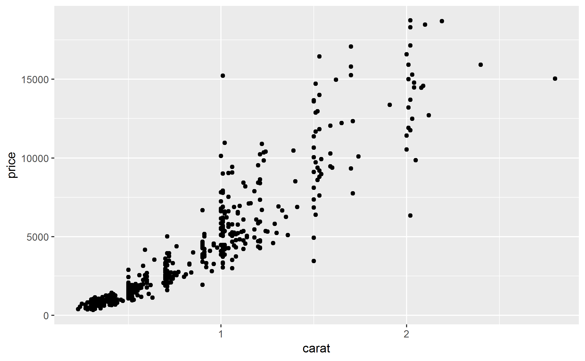
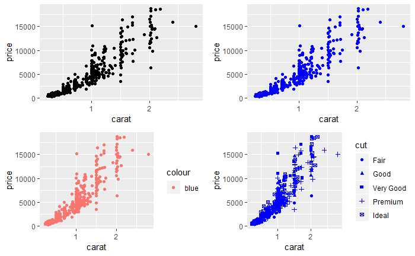
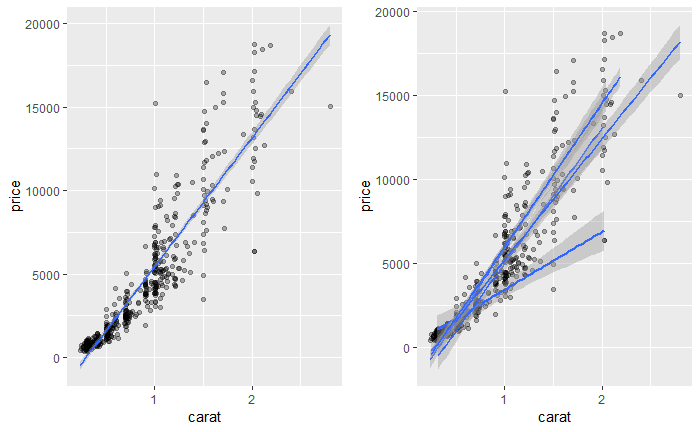
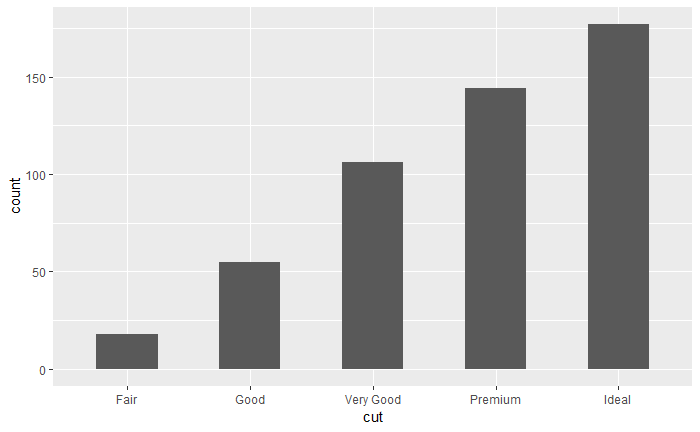
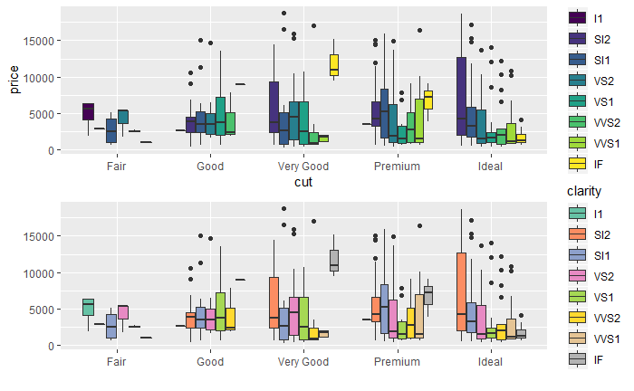
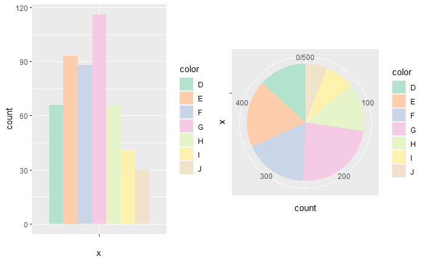
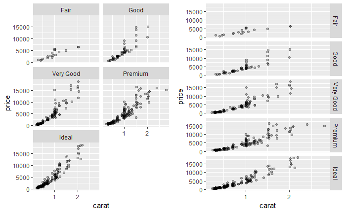
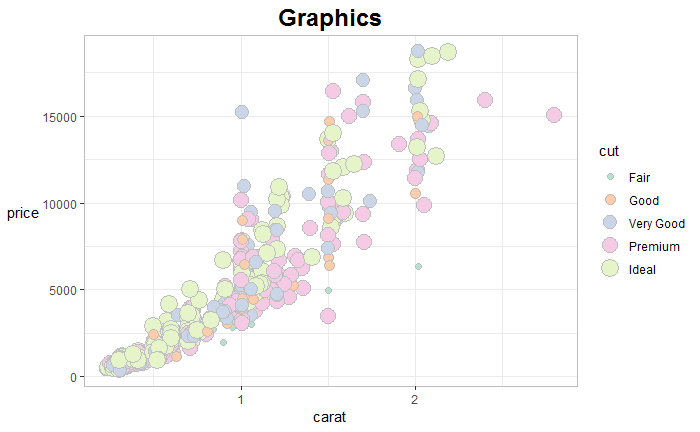

## ggplot2风格绘图

- 与 base 绘图系统不同, **ggplot2** 基于 Leland Wilkinson 在 《Grammar of Graphics》中所提出的图形语法范式, 形成了自己独特的语法系统与绘图思路, 通过不同图形组件的组合、图层的叠加, 生成最终图形. 在 **ggplot2** 中, 通常包括如下几个图形组件: 
    - 数据 (data)
    - 映射 (mapping)
    - 几何对象 (geom)
    - 统计变换 (stats)
    - 标度 (scale)
    - 坐标系 (coord)
    - 分面 (facet)
    - 主题 (theme)

- 以 **ggplot2** 绘制图形, 通常需要如下步骤: 
    - 数据初始化, 生成绘图对象
    - 绘制图层, 通过 `+` 的方式添加图层
    - 调整数据相关图形元素
    - 调整数据无关图形元素
  
### 数据

- **ggplot2** 绘图所用数据必须为数据框格式, 本例使用 **ggplot2** 包自带数据集 diamond, 包含五万多颗钻石的价格及其他属性, 从中随机抽取 500个, 仅以展示绘图效果.

```r
set.seed(123)
library(ggplot2)
row <- sample(nrow(diamonds), 500) 
data <- diamonds[row, ]
```

- 用函数 `ggplot()` 对数据初始化, 但不会生成图像:

```r
grap <- ggplot(data)
```

###  映射与几何对象

- 几何对象即是考虑绘制哪种图形, 映射指数据与几何对象的图形属性相对应, 如下面代码所示, 用函数 `aes()` 将数据集中的变量 carat, price 以点的几何形式映射为图形属性 x, y 轴, 生成一个关于钻石重量和价格的散点图, 参见图 5.11

##### 图 5.11

```{r}
grap + geom_point(aes(x = carat, y = price))
```



- 表 5.11 给出常用的几何对象, 对应的图形属性可自行查看函数的"帮助", 常见的图形属性见表 5.12

##### 表 5.11

几何对象         | 描述  
-----------------|-------
geom_bar()       | 条形图
geom_boxplot()   | 箱线图
geom_density()   | 密度图
geom_histgram()  | 直方图
geom_hline()     | 水平线
geom_jitter()    | 抖动点
geom_line()      | 直线 (按 x 派排序)
geom_path()      | 直线 (按原始排序)
geom_point()     | 数据符号
geom_polygon()   | 多边形
geom_rect()      | 矩形
geom_rug()       | 地毯图
geom_smooth()    | 光滑曲线
geom_text()      | 文本标签
geom_violin()    | 小提琴图
geom_vline()     | 垂线

##### 表 5.12

图形属性     | 描述
------------ | -------
color        | 对点、线和填充区域的边界进行着色
fill         | 对填充区域着色, 如条形和密度区域
alpha        | 颜色的透明度, 从 0(完全透明)到 1(不透明)
linetype     | 图案的线条(1 = 实线, 2 = 虚线, 3 = 点, 4 = 点破折号, 5 = 长破折号, 6 = 双破折号)
size         | 点的尺寸, 线的宽度, 文本高度, 以毫米为单位
shape        | 点的形状( 和 pch 一样)
position     | 绘制诸如条形图和点等对象的位置. 对条形图来说, "dodge" 将分组条形图并排, "stacked" 堆叠分组条形图, "fill" 垂直地堆叠分组条形图并规范其高度相等.对于点来说, "jitter" 减少点重叠
binwidth     | 直方图的宽度
notch        | 表示方块图是否应为缺口 (TRUE/FALSE)
sides        | 地毯图的安置 ("b" = 底部, "l" = 左部, "t" = 顶部, "r" = 右部, "bl" = 左下部, 等等)
width        | 箱线图的宽度

- 应注意映射图形属性与设定图形属性的区别, 前者指以一个图形属性来表示某一变量中的不同观测点, 后者指某一变量中的所有观测点都以一个图形属性表示, 具体参见图 5.12.
    - 左上效果同图 5.11; 右上将所有观测点设定为蓝色; 左下为错误的映射, 这里的 `color = "blue"` 实则将 "blue" 视为一个变量, 以图形属性 color 表示, 因 "blue" 默认为离散变量, 故默认颜色标度为桃红色; 右下为正确的映射, 变量 cut 映射为图形属性 shape, 故不同的 cut 以不同的 shape 表示.
    - 总之, 变量应设在函数 `aes()` 内, 常数设在函数 `aes()` 外.

##### 图 5.12

```r
library(gridExtra) # 控制图形布局
p1 <- ggplot(data, aes(x = carat, y = price)) + geom_point()
p2 <- ggplot(data, aes(x = carat, y = price)) + geom_point(color = "blue")
p3 <- ggplot(data, aes(x = carat, y = price, color = "blue")) + geom_point()
p4 <- ggplot(data, aes(x = carat, y = price, shape = cut)) + geom_point(color = "blue")
grid.arrange(p1, p2, p3, p4, ncol = 2, nrow = 2)
```



- 将观测点分组, 除了将变量映射为形状、颜色等属性, 还可通过图形属性 group 完成, 参见图 5.13

##### 图 5.13

```r
p1 <- ggplot(data, aes(x = carat, y = price)) + geom_point(alpha = 0.3) + geom_smooth(method = "lm")
p2 <- ggplot(data, aes(x = carat, y = price, group = cut)) + geom_point(alpha = 0.3) + geom_smooth(method = "lm")
grid.arrange(p1, p2, ncol = 2)
```



### 统计变换

- **ggplot2** 中的统计变换是指以某种方式对数据信息进行汇总, 其实每个几何对象都有一个默认的统计变换 (stat), 反之亦然. 条形图即是如此, 使用分组统计变换 (binning stat), 再对每组中数据的计数作为绘图的数据, 参见图 5.14.

##### 图 5.14 

```r
grap + geom_bar(aes(x = cut), width = 0.5)
```



- 下面代码会生成和图 5.14 相同的图, 旨在展示如何指定几何对象的统计变换:

```r
cutdata <- as.data.frame(table(data$cut))
ggplot(cutdata, aes(x = Var1, y = Freq)) + geom_bar(stat = "identity", width = 0.5) + labs(x = "cut", y = "count")
```

- 下面代码通过统计变换 `stat_bin()` 生成和图 5.14 相同的图, 此种方法的优点在于可以通过参数更清晰地指定统计变换.

```r
grap + stat_bin(aes(x = as.numeric(cut)), binwidth = 0.5) + scale_x_continuous(breaks = c(1:5),
  labels = c("Fair", "Good", "Very Good", "Premium", "Ideal")) + labs(x = "cut")
```

- 常见的统计变换参见表 5.13, 对应的参数可自行查看函数的"帮助".

##### 表 5.13

统计变换        |  描述
--------------- | --------
stat_bin()      | 分组
stat_boxplot()  | 箱线图统计量
stat_contours() | 等高线
stat_identity() | 不作变换
stat_smooth()   | 光滑化

### 标度

- **ggplot2** 在绘制图形时已经默认生成合适的标度, 其通常与坐标轴和图例相关, 如x, y轴, 以及离散变量映射生成的图例. 可通过标度的设置调整与数据相关的元素, 举例参见图 5.15, 修改了默认的x, y轴标题以及图例颜色.

##### 图 5.15

```r
p1 <- ggplot(data) + geom_boxplot(aes(x = cut, y = price, fill = clarity))
p2 <- ggplot(data) + geom_boxplot(aes(x = cut, y = price, fill = clarity)) + scale_x_discrete(name = "") + scale_y_continuous(name = "") + scale_fill_brewer(palette = "Set2") 
grid.arrange(p1, p2, ncol = 1)
```


- 常用的标度见表5.14, 对应的参数可自行查看函数的"帮助", 每个 x 轴标度都有对应的的 y 轴标度.

##### 表 5.14

标度                | 描述
------------------- | -------
scale_x_continuous()| 连续坐标轴
scale_x_discrete()  | 离散坐标轴
scale_x_data()      | 日期坐标轴
scale_shape()       | 符号形状图例
scale_linetype()    | 线型样式图例
scale_color_manual()| 符号/线颜色图例
scale_fill_manual() | 符号/条带填充图例
scale_size()        | 符号尺寸图例

### 坐标系

- 除了用标度组件来修改数据与图形属性之间的映射, 还可通过坐标系组件 (coord). **ggplot2** 通常用笛卡尔坐标系, 下面代码展示了将坐标系设置为极坐标系, 效果参见图 5.16.

##### 图 5.16

```r
p1 <- ggplot(data) + geom_bar(aes(x = "", fill = color), position = "dodge") + scale_fill_brewer(palette = "Pastel2")
p2 <- ggplot(data) + geom_bar(aes(x = "", fill = color)) + scale_fill_brewer(palette = "Pastel2") + coord_polar(theta = "y")
grid.arrange(p1, p2, ncol = 2)
```


### 分面

- 分面指在同一页面中为数据的各子集生成各自的图形. 主要用函数 `facet_wrap()` 与 `facet_grid()` 创建分面, 主要区别在于前者本质上是一维的, 后者是二维的, 其用法见表5.15, 例图参见图 5.17

##### 表5.15

分面                                 |  描述
------------------------------------ | ----------
facet_wrap(~ var, ncol = n)          | 将每个var水平排列成n列的独立图
facet_wrap(~ var, nrow = n)          | 将每个var水平排列成n行的独立图
facet_grid(rowvar ~ colvar)          | rowvar 和 colvar 组合的独立图, 其中 rowvar 表示行, colvar表示列
facet_grid(rowvar ~ .)               | 每个rowvar水平的独立图, 配置成一个单列
facet_grid(. ~ colvar)               | 每个colvar水平的独立图, 配置成一个单行

##### 图 5.17

```r
p1 <- ggplot(data, aes(x = carat, y = price)) + geom_point(alpha = 0.3) + facet_wrap(~ cut, ncol = 2)
p2 <- ggplot(data, aes(x = carat, y = price)) + geom_point(alpha = 0.3) + facet_grid(cut ~ .)
grid.arrange(p1, p2, ncol = 2)
```



### 主题

- 主题调整图形中非数据元素外观, 主要包括标题、坐标轴标题、图例标签等文本元素以及网格线、背景的颜色搭配, 具体参见图 5.18

##### 图 5.18

```r
ggplot(data, aes(x = carat, y = price, size = cut, fill = cut)) + geom_point(color = "gray", shape = 21) + 
  scale_fill_brewer(palette = "Pastel2") + 
  theme_bw() + 
  labs(title = "Graphics") + 
  theme(plot.title = element_text(face = "bold", size = 18, hjust = 0.5),
        axis.title.y = element_text(angle = 0, vjust = 0.5),
        panel.border = element_rect(color = "gray"))
```


- 常用的主题元素及其所属类型见表 5.16

主题元素          | 类型   | 描述
---------------- | ------ | ------
axis.text.x      | text   | x 轴刻度标签
axis.title.y     | text   | x 轴标题
legend.title     | text   | 图例标题
legend.text      | text   | 图例标签
panel.background | rect   | 面板背景
panel.border     | rect   | 面板边界
panel.grid.major | line   | 主网格线
panel.grid.minor | line   | 次网格线
plot.title       | text   | 图表题
strip.background | rect   | 分面标签背景

### 图形组合

- 在 base 绘图系统中, 通过参数 mfrow 或函数 `layout()` 实现多幅图形的布局与组合, 但此法在 **ggplot2** 中并不适用. 

- 可使用 **gridExtra** 包中的函数达到此目的, 前述例图已使用其中函数 `grid.arrange()`, 可自行了解此包以实现更加复杂的布局.

### 图形输出

- 对于 **ggplot2** 绘图, 常使用函数 `ggsave()` 以更方便地保存图形, 用法如下: 

```
myplot <- ggplot(...) + geom_point(...)
ggsave(filename = "plot.pdf", plot = myplot, width, height, ...)
```
- 若忽略 plot = 参数, 则保存最新创建的图形.

